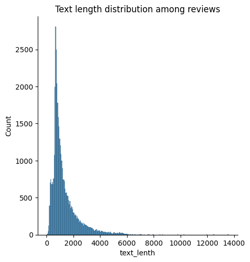
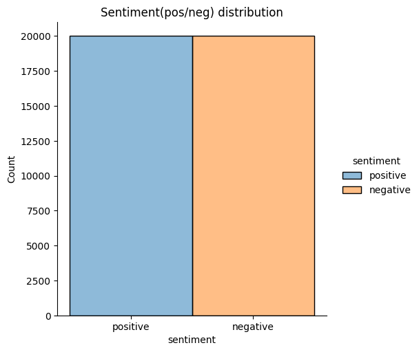
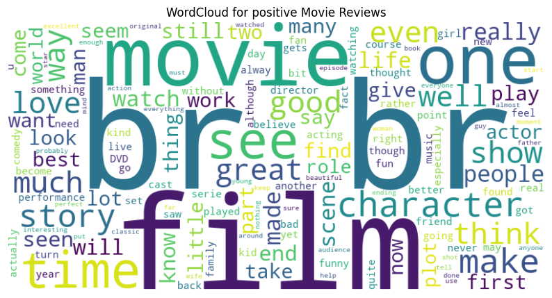
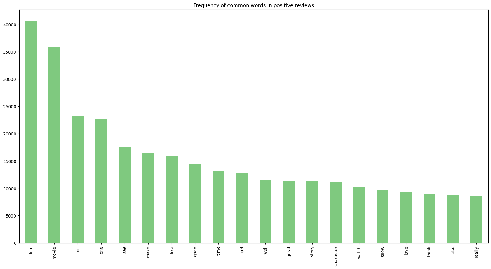
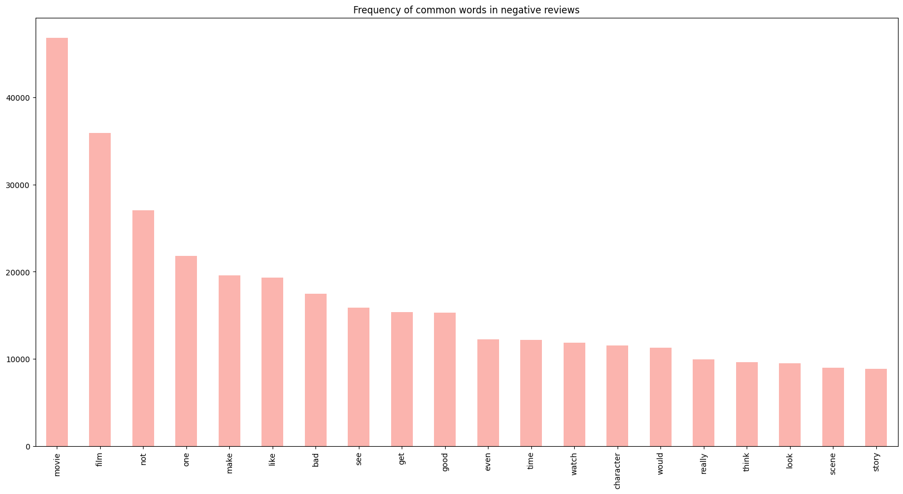
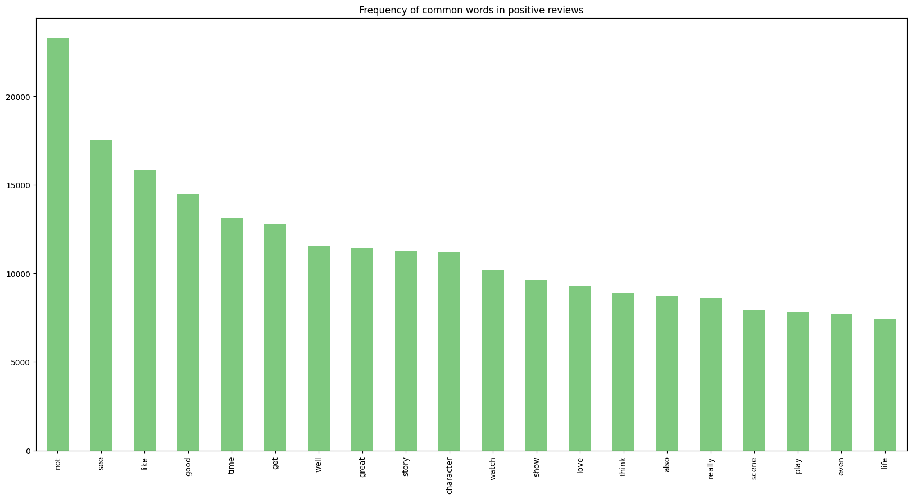
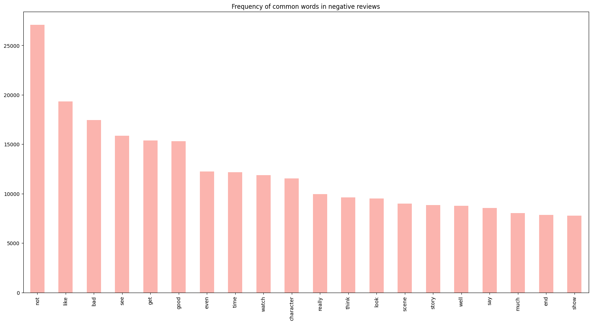

# Sentiment Analysis on movie reviews DS Report

## Introduction

This Data Science report aims to analyze the 50k Movie Reviews dataset, including exploratory data analysis (EDA), feature engineering, modeling, and considerations for potential business applications.<br><br>
**Note: Detailed analysis done in notebook (with code examples), you can use it as reference.*
## EDA


- **Dataset Overview:**
  - Overall 50k polar movie reviews dataset (40k training and 10k for test).
  - Has 2 features `review` and `sentiment` (dtype:str)
  - No any missing values.
  - Text length distribution.
  - 
- **Class Distribution:**
  - Behaviour on reviews equally distributed 25k positive and same for negative.
  
  - Word frequencies on positive reviews before cleaning and preprocessing. (by WordCloud)

  - Same for negative behavour.
 

- **Basic Text Cleaning:**
    - Sentences lower cased
    - Removed irrelevant chars (punctuations,numberc,etc)
    - Removed HTML tags and URLs
    - Removed words has length less than 2
    - Documents tokenized (for further analysis)

- **Stemming vs Lemmatization:**
  - Comparison between Stemming and Lemmatization approaches done with text examples. (*Use notebook for reference here.*)

- **Stop-Words Filtering:**
  - Stop-Words downloaded with NLTK library and removed from the text
  - Some stop-words filtered (negation stopwords like: `not`, `never`, `nor`) not to remove as they give much weight on sentiment behaviour.

- **Text Vizualization Analysis:**
  - Most common words by sentiment behavoiur:


  - Removed words like `"movie,film,one..."` as they have nothing to do with sentiment behaviour:


- **Vectorization:**
  - Used TF_IDF method on BoW technique with most frequent 7k words as this method gives more weight to common words than rare ones
  - N-Gram Analysis done: Unigrams and Bigrams perfomance compared on baseline model (*Use notebook as reference*)
  - Unigrams on top of TF-IDF vectorization method chosen for further analysis as it over perfomed (*and this is logical: importance of every word is more essential than the relationship with them in this case*)

## Modeling
Building and evaluating machine learning models based on the preprocessed text data.

- **Baseline Model:**
  - Built a baseline classifier model using LogisticRegression.
  - Fine-tuned regularization using Grid Search
  - Accuracy: 89%

- **RandomForestClassifier:**
  - Built a model with default parameters.
  - Applied simple CountVectorizer
  - Got accuracy: 86%

- **DL Model:**
    - Text to sequence method applied (Takes text as input and indexes every unique word)
    - Padding sequences
    - Sequential model used with fully connected layers* (*Use notebook to see model architecture*)
    - Got accuracy: 86%

- **Model Selection:**
  - All models' perfomances evaluated and **LogisticRegression** model chosen as production model.

- **Overall Performance Evaluation:**
  - Final model's overall perfomance evaluated and got accuracy of 88.5%

## Potential Business Applications and Value

Potential applications of the model in a business context and the value it provides.

- **Competetive advantage:**
  - Businesses that effectively utilize sentiment analysis can gain a competitive advantage by staying attuned to customer preferences and making strategic decisions based on real-time feedback.

- **Customer Feedback Analysis for Platforms:**
  - Identifying negative sentiment early on allows businesses to address issues promptly, minimizing potential damage to their brand or product reputation.

- **Content Recommendation Improvement:**
  - Platforms providing movie recommendations can significantly improve user satisfaction by using sentiment analysis to refine and optimize their content recommendation algorithms.

----

# Technical overview and instructions

## Data:
Data can be loaded with `src/data_loader.py` script to the `data/raw` directory via building Docker training image. Training script will automatically cleans and preprocesses the data and saves `data/processed` directory.
## Training:
The training phase of this project can be done by running `src/training/train.py` script.
<br>To train the model using Docker following insturctions should be done: 
- Build the training Docker image using this command:
```bash
docker build -f ./src/training/Dockerfile  --build-arg MODEL_NAME=<your_model_name.joblib> -t training_image .
```
Replace `model_name` whatever you want for the name of your model but make sure to give `.joblib` extension to it.
- After successfull built you have to run the container that actually trains the model, and mounts `outputs/models` and `/data` folders on container to your local machine by the following command:
```bash
docker run -v $(pwd)/outputs/models:/app/outputs/models -v $(pwd)/data:/app/data training_image
```
If you get an error, probably it is because there are some whitespaces in your printed working directory(pwd).
To handle this instead of using `pwd` write your project path by hand like:`/Users/john/desktop/DS-final-task`.
In the shell (terminal, powershell) you can see the training phase with `logging.info` created by the script along with model's `accuracy` score.
Make sure that `train.csv` and `test.csv` created in `data/raw` and 'clean_train.csv' in 'data/processed' folder along with your model in `outputs/models` folder.
## Inference
Once a model has been trained, it can be used to make predictions on new data in the inference stage. The inference stage is implemented in inference/run.py.
- Build the inference Docker image:
```bash
  docker build -f ./src/inference/Dockerfile -t inference_image .
```
- Run the inference Docker container with following command:
``` bash
docker run -v $(pwd)/outputs/predictions:/app/outputs/predictions inference_image
```
Make sure you don't get any errors related to your pathname (pwd). After succesfull run, inference phase can be shown in shell, and what's more important is that `/predictions` folder in container will be mounted on your local `/predictions` folder which keeps result of the models prediction (csv file)  on inference data.
## What's more
- Some exceptions are included in some problematic parts in the code.<br> *Looking forward to get your feedback, and if you don't get any desired results please let me know.*


